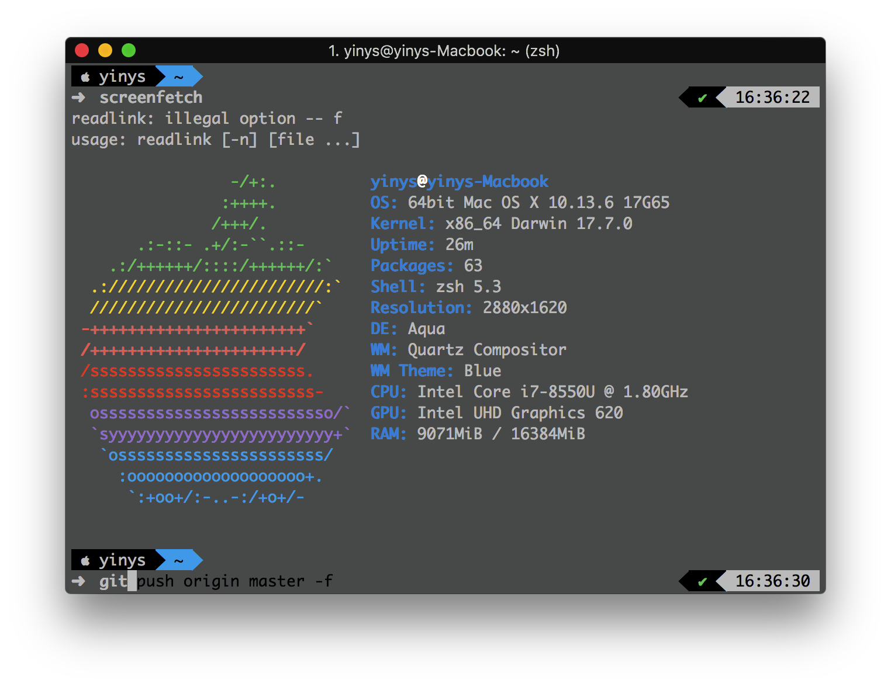
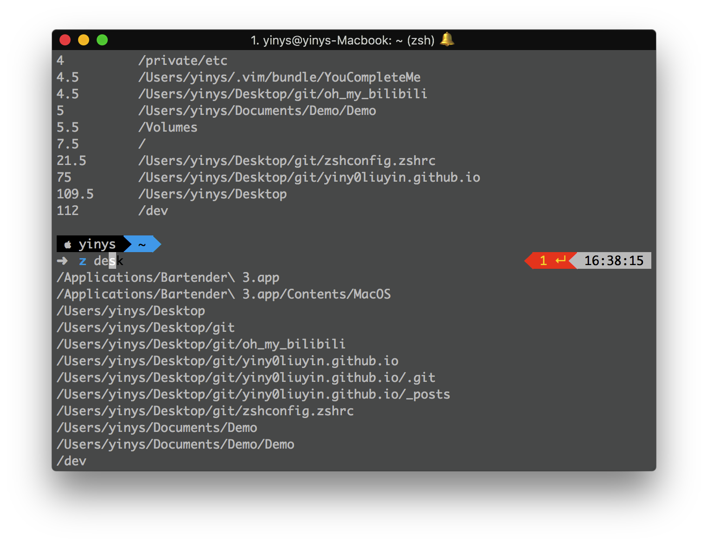

# 一键式配置zsh(自用)
在知乎大神的基础上进行修改,配置自己的.zshrc
****
## 效果


## 实现的功能
自动跳转  
高亮  
安装皮肤powerlevel9k    
命令提示  
自动补全  
....

# 依赖
请检查是否已经安装git,zsh,oh-my-zsh.  
大陆用户确保已经使用了代理   

* ~~请使用127.0.0.1:1086的socks端口 否则请自行修改 安装.zshrc 中的 ` export all_proxy=127.0.0.1:1086 ` 改成 其他~~
* 请使用 powerline字体  
## 安装oh-my-zsh
请确保已安装curl    

```bash  
sh -c "$(curl -fsSL https://raw.githubusercontent.com/robbyrussell/oh-my-zsh/master/tools/install.sh)"
```

# 安装antigen
```bash
cd ~ && git clone https://github.com/yiny0liuyin/zshconfig.zshrc.git && cd zshconfig.zshrc && mv 安装antigen.zshrc ~/.zshrc && zsh
```
# 使用
安装完成后 请执行 

```bash
cd && cd zshconfig.zshrc && mv .zshrc ~/.zshrc 
```

## 如果你觉得麻烦请执行(忽略以上两条代码)
```bash
git clone https://github.com/yiny0liuyin/zshconfig.zshrc.git && cd zshconfig.zshrc && mv 原始.zshrc ~/.zshrc && zsh
```

